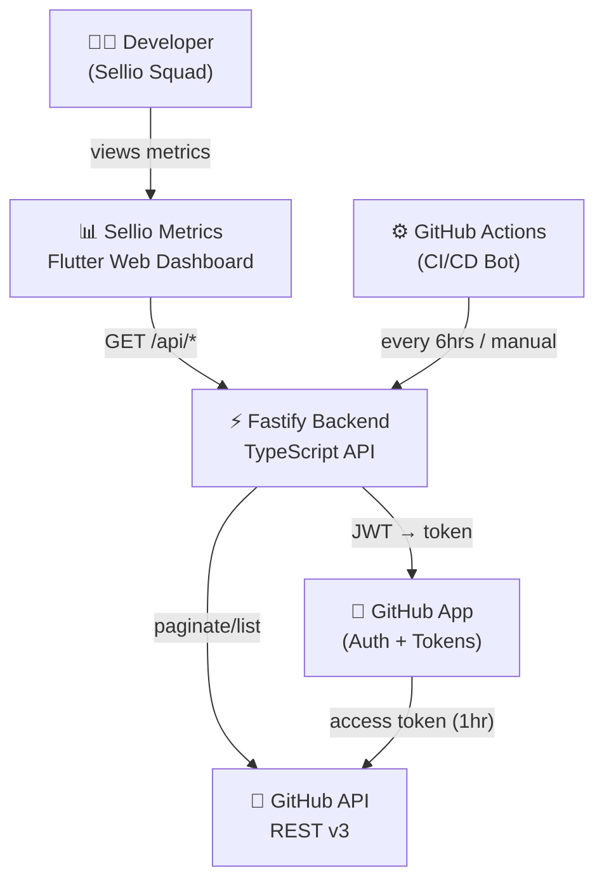
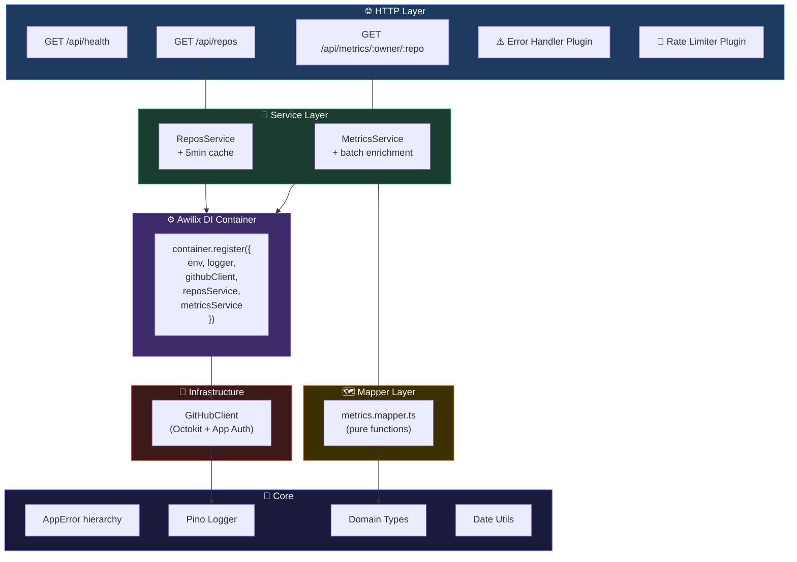
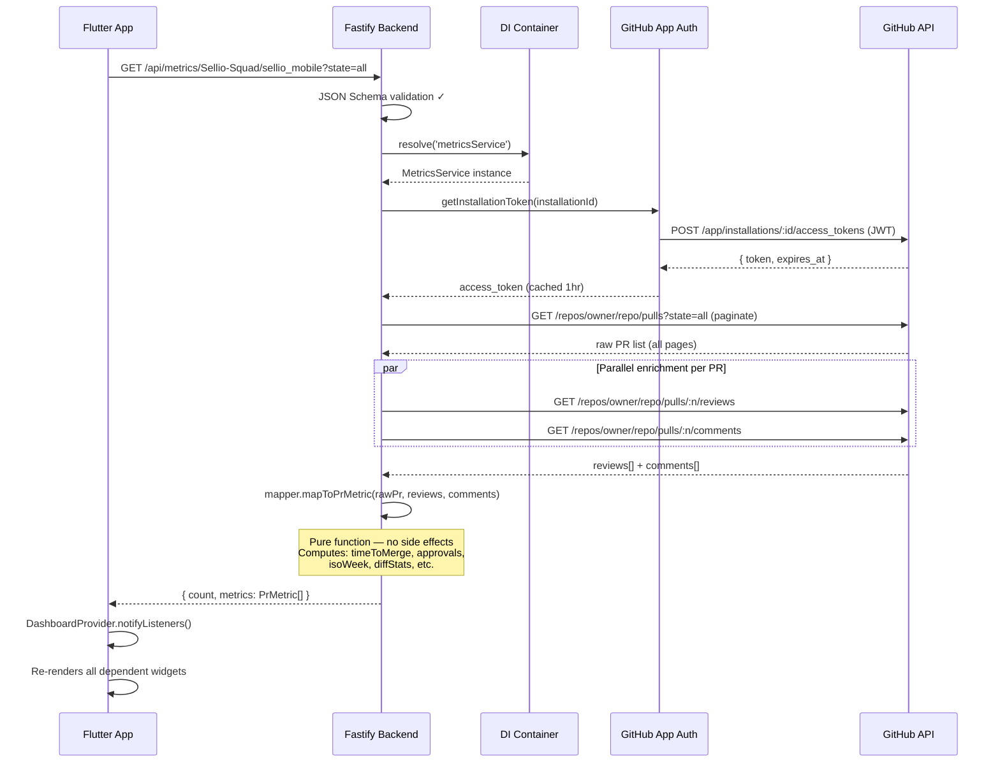
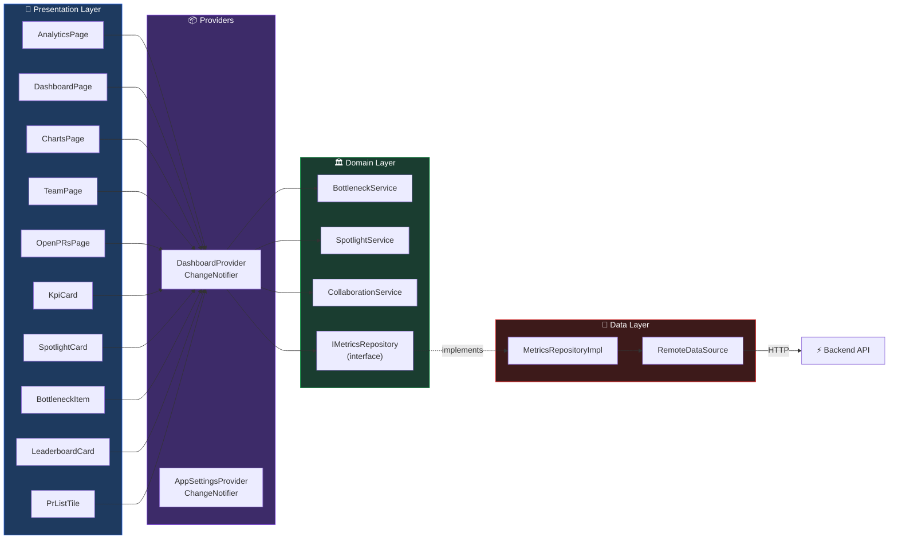
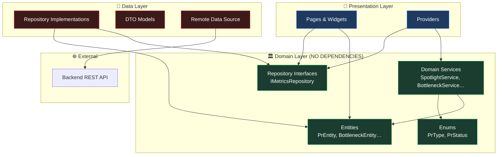
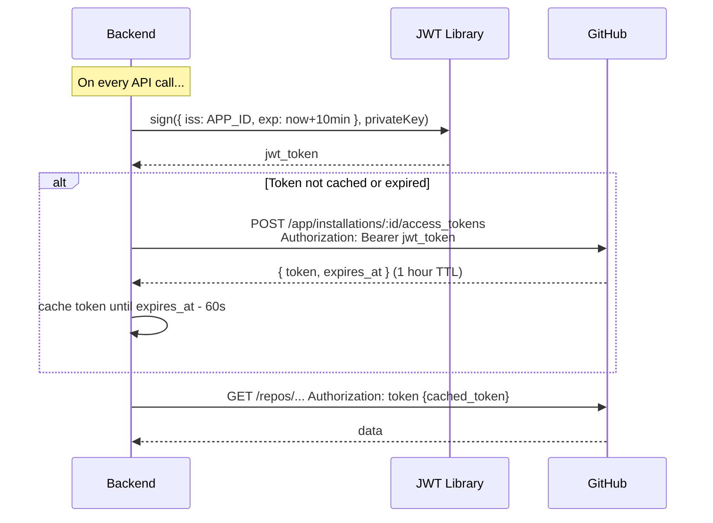
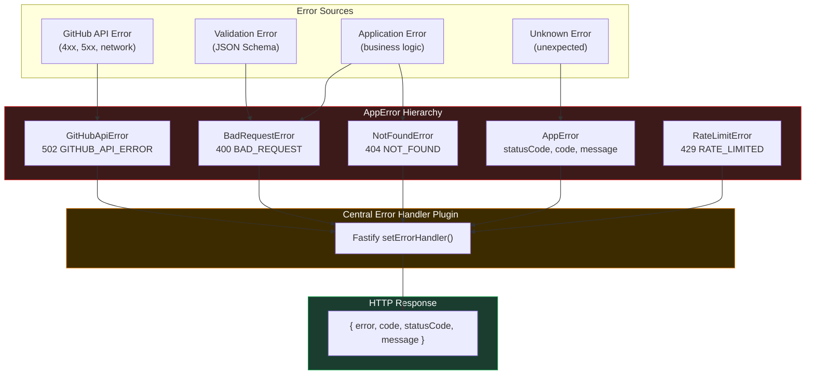
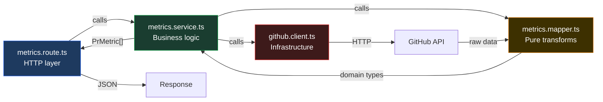
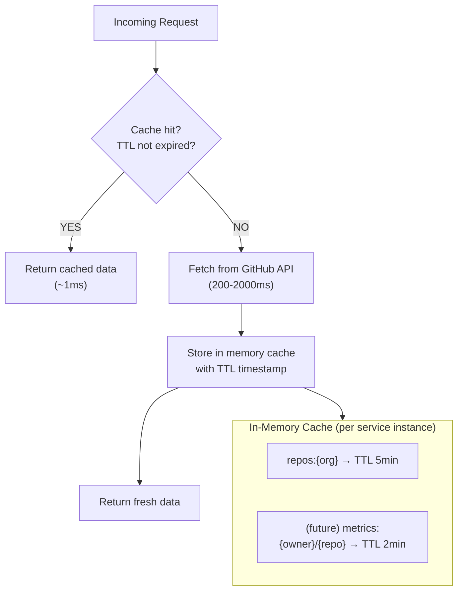
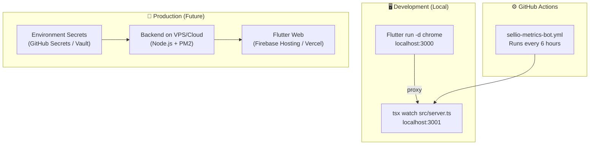

# 🏛️ Sellio Metrics — Architecture Deep Dive

This document provides detailed architecture diagrams for every layer of the system.

---

## 1. System Context



---

## 2. Backend Layer Architecture



---

## 3. PR Metrics Data Flow (Sequence)



---

## 4. Frontend State Architecture



---

## 5. Clean Architecture Dependency Rule



> **🔑 The Dependency Rule:** Source code dependencies must point only **inward**.  
> Domain knows nothing about Presentation or Data. Data knows about Domain (implements its interfaces). Presentation knows about Domain (uses its types and interfaces).

---

## 6. GitHub App Authentication Flow



---

## 7. Error Handling Architecture



---

## 8. Module Structure (Feature Slice)

Each feature module is a self-contained vertical slice:

```
modules/metrics/
├── metrics.route.ts     ← HTTP boundary (JSON Schema, DI resolution)
│                           knows: Fastify, Cradle, MetricsQuerySchema
│                           does NOT know: GitHub, Octokit
│
├── metrics.service.ts   ← Business orchestration
│                           knows: GitHubClient, domain types
│                           does NOT know: HTTP, response format
│
├── metrics.mapper.ts    ← Data transformation (PURE FUNCTIONS)
│                           knows: RawGitHubPr → PrMetric
│                           does NOT know: services, routes, HTTP
│
└── metrics.types.ts     ← Module-specific types
                            MetricsQueryParams, MetricsResponse
```



---

## 9. Caching Strategy



> **Note:** Cache is in-memory per Node.js process. On multi-instance deployments, consider replacing with Redis. For single-instance (current), this is optimal.

---

## 10. Deployment Architecture



---

*Last updated: February 2026 | Sellio Squad*
