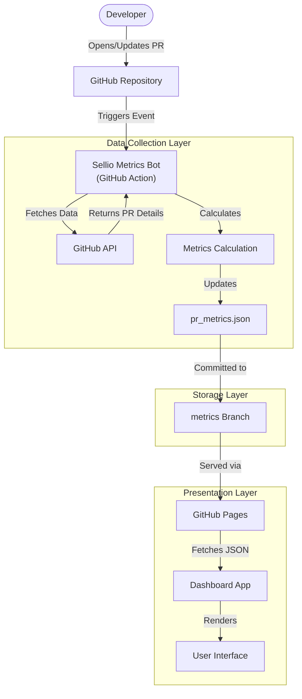

# Sellio Squad Dashboard

Real-time team metrics dashboard with modular architecture and clean separation of concerns.

## 🎯 Overview

This dashboard provides real-time insights into your team's pull request performance:

- **PR Velocity**: Track PRs opened vs merged over time
- **Time to Merge**: Understand merge efficiency
- **Review Efficiency**: Monitor approval times
- **❗ Bottleneck Analysis**: Identify stuck PRs with severity indicators
- **Team Performance**: Individual contributor metrics

---

## 🏗️ Architecture

The dashboard follows **Clean Architecture** with modular organization:

```
team_metrics_dashboard/
├── index.html                  # Main HTML
├── package.json
├── README.md
│
├── styles/
│   └── main.css               # All styles with Sellio theme
│
└── src/
    ├── app.js                 # Main entry point
    │
    ├── config/                # Configuration
    │   ├── constants.js       # App constants (PR types, thresholds)
    │   ├── theme.js           # Sellio color palette & design tokens
    │   └── settings.js        # User settings with localStorage
    │
    ├── resources/
    │   └── strings.js         # All UI text & messages
    │
    ├── utils/                 # Utilities
    │   ├── dateUtils.js       # Date manipulation
    │   ├── formatters.js      # Number/text formatting
    │   └── mockDataGenerator.js  # Mock data for testing
    │
    ├── services/
    │   └── analyticsService.js   # Business logic & calculations
    │
    ├── components/            # UI Components
    │   ├── kpiCards.js        # KPI card rendering
    │   ├── bottleneckPanel.js # Bottleneck visualization
    │   ├── mergeHealth.js     # Merge process health
    │   └── otherComponents.js # Daily activity, PR types, etc.
    │
    └── core/
        └── dashboard.js       # Main Dashboard class
```

### Architecture Benefits

✨ **Separation of Concerns**: Each module has single responsibility  
🔄 **Reusability**: Components can be used independently  
📖 **Maintainability**: Easy to find and update code  
🧪 **Testability**: Pure functions easy to test  
🎨 **Consistency**: Centralized theme and strings  
⚙️ **Customization**: User-configurable settings  


---

## 🔄 Data Pipeline Architecture

The metrics system operates on a separation of concerns between **Data Collection** and **Data Visualization**.



### How It Works

1.  **Data Collection (The Bot)**
    *   The **Sellio Metrics Bot** (a GitHub Action defined in `.github/workflows/sellio-metrics-bot.yml`) listens for PR events (open, close, review, comment).
    *   It fetches real-time data from the GitHub API.
    *   It calculates complex metrics like *Time to First Approval* and *Review Velocity*.
    *   It effectively builds a "database" in the `pr_metrics.json` file.

2.  **Data Storage**
    *   The processed data is stored in `pr_metrics.json` on the orphan `metrics` branch.
    *   This decoupling ensures the main codebase remains light and the dashboard loads quickly without hitting GitHub API rate limits directly from the client.

3.  **Data Visualization (The Dashboard)**
    *   The frontend dashboard fetches this pre-computed `pr_metrics.json`.
    *   It uses `AnalyticsService` to aggregate and display the KPIs, Bottlenecks, and Charts.

---


## 📊 Features

### Core Metrics
- Total PRs, Merged PRs, Closed PRs
- Average PR Size (additions/deletions)
- Comments statistics
- Time to first approval
- PR lifespan

### 🚨 Bottleneck Analysis
Identifies PRs stuck in review with:
- **Severity Classification**: Low, Medium, High
- **Wait Time Tracking**: Days/hours waiting
- **Configurable Threshold**: Default 48 hours
- **Visual Indicators**: Color-coded severity

### Spotlight Metrics
- 🔥 Hot Streak: Most active contributor
- ⚡ Fastest Reviewer: Quickest reviews
- 💬 Top Commenter: Most engaged in discussions

### Additional Insights
- Daily activity breakdown by week
- PR type distribution (fix, feature, chore, etc.)
- Collaboration pairs (who reviews whose PRs)
- Most discussed PRs

---

## 🚀 Quick Start

### Local Development

```bash
cd team_metrics_dashboard

# Option 1: Python HTTP server
python -m http.server 8000

# Option 2: Node.js HTTP server
npx http-server -p 8000

# Open browser
open http://localhost:8000
```

### Configuration

Edit `src/config/constants.js` to customize:

```javascript
export const BOTTLENECK = {
    DEFAULT_THRESHOLD_HOURS: 48,  // Adjust threshold
    MAX_DISPLAY_COUNT: 10         // Max bottlenecks shown
};

export const ANALYTICS = {
    REQUIRED_APPROVALS: 2         // Required approvals
};
```

Edit `src/config/theme.js` for Sellio branding colors.

Edit `src/resources/strings.js` for UI text customization.

---

## 🎨 Theme System

The dashboard uses a comprehensive theme system with Sellio branding:

```javascript
// Light mode colors
primary: '#4f46e5'         // Indigo
success: '#10b981'         // Green  
warning: '#f59e0b'         // Amber
danger: '#ef4444'          // Red

// Semantic tokens for consistency
bgPrimary, bgSecondary, border
textPrimary, textSecondary, textTertiary
```

Supports dark mode with automatically adjusted colors.

---

## 💾 Settings & Persistence

User settings are stored in localStorage:

```javascript
{
    bottleneck: {
        thresholdHours: 48,
        enableNotifications: false
    },
    analytics: {
        requiredApprovals: 2,
        autoRefreshEnabled: false
    },
    filters: {
        rememberFilters: true
    }
}
```

Settings API:
```javascript
import { loadSettings, saveSettings, updateSetting } from './src/config/settings.js';

const settings = loadSettings();
updateSetting('bottleneck.thresholdHours', 72);
```

---

## 🔧 Development

### Module Structure

**Config**: Constants, theme, settings  
**Resources**: UI strings for localization  
**Utils**: Pure utility functions  
**Services**: Business logic (analytics calculations)  
**Components**: UI rendering functions  
**Core**: Main application class  

### Adding New Features

1. **New Metric**: Add to `services/analyticsService.js`
2. **New Component**: Create in `components/`
3. **New Constant**: Add to `config/constants.js`
4. **New UI Text**: Add to `resources/strings.js`

### Code Style

- ES6 modules with named exports
- JSDoc comments on all exports
- Pure functions where possible
- Descriptive variable/function names

---

## 📈 Data Source

The dashboard can fetch data from two sources:

### 1. GitHub API (Real Data)

Fetch real pull request data from your GitHub repository.

#### Setup Instructions

1. **Create GitHub Configuration File**
   ```bash
   cd team_metrics_dashboard/src/config
   copy github-config.example.js github-config.js
   ```

2. **Get Your Sellio Bot Token**
   
   If you have a GitHub App bot (like "Sellio Bot"):
   - Go to your GitHub App settings
   - Generate an installation access token
   - Copy the token

   Or create a Personal Access Token:
   - Go to GitHub Settings → Developer settings → Personal access tokens → Tokens (classic)
   - Click "Generate new token (classic)"
   - Give it a name (e.g., "Sellio Dashboard")
   - Select scope: `repo` (full control of private repositories)
   - Generate and copy the token

3. Edit `github-config.js` and add your credentials:
   ```javascript
   export const GITHUB_CONFIG = {
       REPO_OWNER: 'Sellio-Squad',    // Your GitHub org
       REPO_NAME: 'sellio_mobile',     // Your repo name
       ACCESS_TOKEN: 'your_token_here', // Your bot token or PAT
       API_BASE_URL: 'https://api.github.com'
   };
   ```

4. **Test the Integration**
   - Open the dashboard
   - Check the API status panel at the top of the Analytics tab
   - Should show "Connected to GitHub" with a refresh button

#### Features

- **Automatic Caching**: Data is cached for 15 minutes to avoid rate limits
- **Rate Limit Display**: Shows remaining API calls and reset time
- **Manual Refresh**: Refresh button to fetch latest data
- **Error Handling**: Falls back to mock data if GitHub API fails
- **Smart Fetching**: Fetches last 90 days of PRs with pagination

#### Troubleshooting

**"Not Configured" status**
- Check that `github-config.js` exists and has valid credentials
- Ensure the token is not set to `'YOUR_SELLIO_BOT_TOKEN_HERE'`

**"Connection Error"**
- Verify your token has `repo` scope access
- Check that the repository owner and name are correct
- Ensure your token hasn't expired

**Rate Limit Exceeded**
- Wait for the rate limit to reset (shown in the status panel)
- Cached data will continue to work
- Authenticated requests have 5,000 requests/hour

### 2. Mock Data (Development/Demo)

If GitHub is not configured, the dashboard automatically uses generated mock data for demonstration and development purposes.

---

## 🎯 Roadmap

- [ ] **Configurable Thresholds UI**: Settings panel for bottleneck threshold
- [ ] **Notification System**: Alerts for new bottlenecks
- [ ] **Historical Trends**: Track metrics over time
- [ ] **GitHub API Integration**: Real PR data
- [ ] **Export Features**: Download reports as CSV/PDF
- [ ] **Team Comparison**: Side-by-side developer stats

---

## 🐛 Troubleshooting

### No Data Showing
- Check browser console for errors
- Verify all modules loaded correctly
- Ensure using HTTP server (not `file://`)

### Module Loading Errors
- Check all file paths in imports
- Ensure using `type="module"` in script tag
- Verify browser supports ES6 modules

### Styles Not Loading
- Check `styles/main.css` path in HTML
- Clear browser cache
- Verify CSS file exists

---

## 📝 License

Part of the Sellio project.

---

**Last Updated**: 2026-01-18  
**Version**: 2.0.0 (Modular Architecture)
